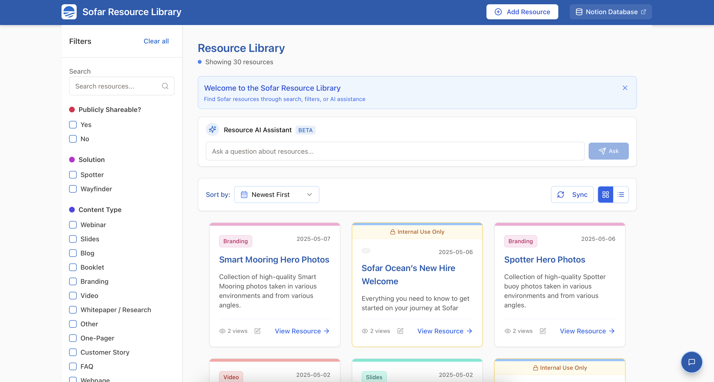

# Sofar Resource Library

A dynamic web portal for marine intelligence resource management, combining intelligent content discovery with an engaging user experience and streamlined content governance.

**Live Application**: [https://sofar-resource-library.replit.app/](https://sofar-resource-library.replit.app/)



## Overview

The Sofar Resource Library is an portal that provides access to Sofar's comprehensive collection of resources. It synchronizes with a Notion database to display up-to-date resources while providing an intuitive filtering, browsing, and searching experience.

## Key Features

- **Real-time Notion Integration**: Automatic synchronization with Sofar's Notion database ensures all resources are current
- **Intelligent Search**: AI-powered "Ask about resources" feature helps discover resources through natural language queries
- **Advanced Filtering**: Filter resources by type, product, audience, messaging stage, and more
- **Resource Analytics**: Track and display view counts to monitor resource popularity
- **Visual Type Indicators**: Color-coded cards for easy resource categorization
- **Internal Resource Management**: Clear visual indicators for internal-only resources
- **Direct Resource Editing**: "Edit in Notion" functionality for seamless content governance
- **User Feedback Collection**: Integrated feedback form that submits to a separate Notion database
- **Responsive Design**: Optimized for desktop and mobile browsing

## Technology Stack

- **Frontend**: React with TypeScript, Tailwind CSS, shadcn UI components
- **Backend**: Express (Node.js) with TypeScript
- **Database**: PostgreSQL for persistent storage
- **APIs**: 
  - Notion API for resource data and feedback collection
  - OpenAI API for intelligent resource discovery
- **Embeddings**: Vector-based semantic search capabilities

## Getting Started

### Prerequisites

- Node.js v18+ 
- PostgreSQL database
- Notion integration with access to resource database
- OpenAI API key for the AI assistant feature

### Installation

1. Clone the repository
2. Install dependencies:
   ```bash
   npm install
   ```
3. Set up your environment variables in `.env`:
   ```
   DATABASE_URL=<your-postgres-connection-string>
   OPENAI_API_KEY=<your-openai-api-key>
   NOTION_API_KEY=<your-notion-api-key>
   NOTION_RESOURCE_DATABASE_ID=<your-notion-database-id>
   NOTION_FEEDBACK_DATABASE_ID=<your-notion-feedback-database-id>
   ```
4. Run the database migration:
   ```bash
   npm run db:push
   ```
5. Start the development server:
   ```bash
   npm run dev
   ```

## Notion Integration

The application connects to two Notion databases:

1. **Resource Database**: Contains all the resources with their metadata, URLs, and content details
2. **Feedback Database**: Stores user feedback and bug reports

For detailed instructions on setting up these databases, see the [Notion Connection Guide](./notion-connection-guide.md).

## Resource Types and Colors

The application uses a consistent color system for different resource types:

| Resource Type | Color |
|---------------|-------|
| Webinar | Cyan |
| Slides | Teal |
| Customer Story | Indigo |
| Blog | Amber |
| Video | Red |
| One-Pager | Kelly Green |
| Whitepaper | Purple |
| Media | Fuchsia |
| Partner Enablement | Green |
| Webpage | Orange |
| Branding | Pink |

## License

Sofar Proprietary. All rights reserved.

## Project Structure

```
├── client/               # Frontend React application
│   ├── src/
│   │   ├── components/   # Reusable UI components
│   │   ├── hooks/        # Custom React hooks
│   │   ├── lib/          # Utilities and helpers
│   │   └── pages/        # Application pages
├── server/               # Backend Express application
│   ├── embeddings.ts     # Vector embeddings utilities
│   ├── feedback.ts       # Feedback submission logic
│   ├── index.ts          # Server entry point
│   ├── notion.ts         # Notion API integration
│   ├── openai.ts         # OpenAI integration
│   ├── routes.ts         # API routes
│   └── storage.ts        # Database access layer
└── shared/               # Shared code between frontend and backend
    └── schema.ts         # Database schema and types
```

## Credits

Developed by the Sofar team.
